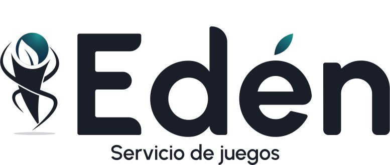

<h1 align="center">
  
</h1>


<div align="center">
  <table>
      <tr>
          <!-- Do not translate this table -->
          <td><a href="./README.md"> English </a></td>
          <td><a href="./README-ES.md"> Spanish </a></td>
      </tr>
  </table>
</div>


"Edén: Servicio de juegos" es un sistema de información estructurado por tres componentes,
incluyendo un CRM, un portal informativo y una aplicación móvil. Eden es un 
sistema de gestión logística y de información para la administración de
clubes sociales y deportivos, que apoya especialmente las disciplinas deportivas de "bolas 
criollas" y dominó.

Este repositorio corresponde al componente de la aplicación móvil, que está 
especialmente enfocado a la visualización de datos del club, notificaciones, perfiles de 
usuarios y/o perfiles de los jugadores y, si se dan los permisos correspondientes 
la gestión de los partidos deportivos.

## Comenzando 🚀 

La aplicación está desarrollada con React Native para el frontend y PHP con Laravel para el 
backend y también hace uso de otras librerías que son necesarias para el correcto funcionamiento 
de la aplicación.

### Prerrequisitos 📋 

* [Node.js](https://nodejs.org/en/) versión 18.12.1

* [Postman](https://www.postman.com/) para las peticiones HTTP.

* Para el proyecto se utilizó [Visual Studio Code](https://code.visualstudio.com/) como editor de texto tanto para el frontend como para el backend, pero también se puede utilizar cualquier editor de texto.

### Instalación 🔧 

Para comenzar, se procede a la descarga del repositorio. Para ello, se abre la consola,
ir a la carpeta donde se desea guardar el proyecto y ejecutar el siguiente comando:

```bash
  git clone https://github.com/gustavoerivero/EdenMobile.git
```

A continuación, se debe acceder a la carpeta clonada en el repositorio "EdenMobile".

Para un sistema operativo Windows, con el comando:

```bash
cd EdenMobile
```

A continuación, se procede a la instalación de las librerías y dependencias necesarias para su ejecución.

```bash
npm install
```

O, como alternativa;

```bash
yarn install
```

Si ninguna de las opciones anteriores funciona, intentar con;

```bash
npm i -f
```

Una vez que la instalación de las dependencias es exitosa, el proyecto está listo para desplegar.

## Despliegue 📦  

Para realizar un despliegue local, se procede ejecutando los siguientes comandos:

### Primer paso: Iniciar Metro

En primer lugar, es necesario iniciar Metro, el bundler de JavaScript que viene con React Native. 

Para iniciar Metro, hay que ejecutar ```npx react-native start``` o, ```yarn react-native start``` 
dentro de la carpeta del proyecto Eden:

```bash
  npx react-native start
```

o

```bash
    yarn react-native start
```

Esto permitirá iniciar el Metro Bundler.

### Segundo paso: Iniciar el proyecto

Dejar que Metro Bundler se ejecute en el terminal. Ahora bien, abrir un nuevo terminal dentro del proyecto Eden . Consecuentemente, se debe ejecutar lo siguiente:

```bash
  npx react-native run-android
```

o

```bash
    yarn react-native run-android
```

Si todo está configurado correctamente, se debería ver la aplicación funcionando en 
un emulador de Android en breve.

```npx react-native run-android``` o ```yarn react-native run-android```, son formas de ejecutar la aplicación, pero también se puede ejecutar directamente desde Android Studio.

Para más información, es posible acceder directamente a la [documentación de React Native](https://reactnative.dev/docs/environment-setup).

## Documentación 📕 

Para conocer la documentación utilizada para el desarrollo de la aplicación, es posible visitar la [documentación](https://drive.google.com/drive/folders/1mAbI0DoGZUTUPalTCa9e0e3yG1RdAi9N).

## Autores 💻 

El proyecto ha sido concebido, diseñado y desarrollado por estudiantes del último semestre de Ingeniería Informática de la Universidad Centroccidental "Lisandro Alvarado" de la LXIII promoción agrupados bajo el nombre de "Eurus".

### Thoteam ✒️
Sin embargo, para el desarrollo de la aplicación móvil, el desarrollo fue 
llevado a cabo por el subgrupo Thoteam, formado por;

*  @gustavoerivero  - [gustavoerivero](https://github.com/gustavoerivero)
*  @joseriveroc - [joseriveroc](https://github.com/joseriveroc)
*  @luisv98   - [luisv98](https://github.com/luisv98)

---

<p align="center">
 <a href="http://www.ucla.edu.ve/">
  
 </a>
 <a href="http://dcyt.ucla.edu.ve/">
  
 </a>
 
 
</p>

---
⌨️ hecho con ❤️ por [Thoteam] 
