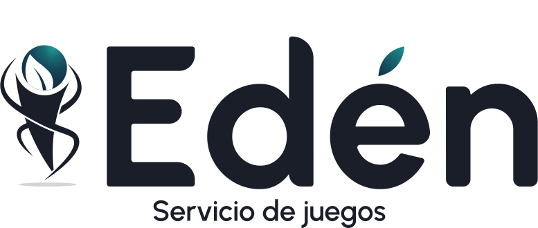
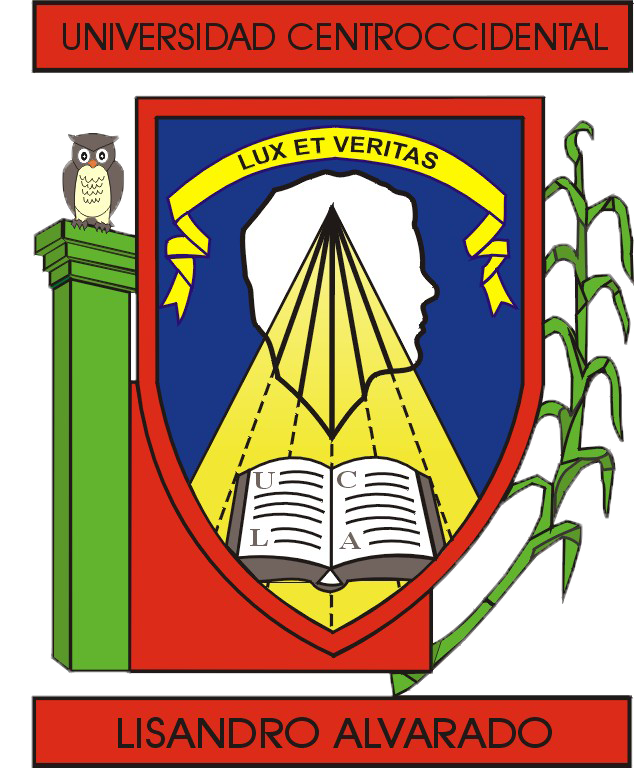
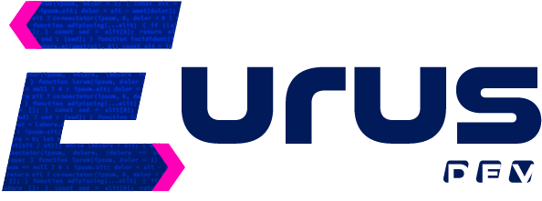

<h1 align="center">
  
</h1>


<div align="center">
  <table>
      <tr>
          <!-- Do not translate this table -->
          <td><a href="./README.md"> English </a></td>
          <td><a href="./README-ES.md"> Spanish </a></td>
      </tr>
  </table>
</div>


"Edén: Servicio de juegos" is an information system structured by three components, 
including a CRM, an information portal and a mobile application. Eden is a 
logistic and information management system for the administration of social 
and sports clubs, which supports especially the sports disciplines of "bolas 
criollas" and dominoes.


This repository corresponds to the mobile application component, which is 
especially focused on the visualization of club data, notifications, user 
and/or player profiles and, if the corresponding permissions are granted, 
the management of sports matches.
## Getting Started 🚀

The application is developed with React Native for the frontend and 
PHP with Laravel for the backend and also makes use of other libraries 
that are necessary for the proper functioning of the application.

### Prerequisites 📋

* [Node.js](https://nodejs.org/en/) version 18.12.1

* [Postman](https://www.postman.com/) for HTTP requests.

* For the project, [Visual Studio Code](https://code.visualstudio.com/) was used as text editor for both frontend and backend, but any text editor can also be used.

### Installation 🔧

To begin, we proceed to download the repository. To do this, we open the console,
 go to the folder where we want to save the project and run the following command:

```bash
  git clone https://github.com/gustavoerivero/EdenMobile.git
```

Next, go to the cloned folder in the "EdenMobile" repository.

For a Windows operating system, with the command:

```bash
cd EdenMobile
```

Next, we proceed to the installation of the libraries and dependencies necessary for its execution.

```bash
npm install
```

Or, alternatively;

```bash
yarn install
```

If it doesn't work, try with:

```bash
npm i -f
```

Once the installation of the dependencies is successful, the project is ready to deploy.
## Deployment 📦 

To perform a local deployment, we proceed by executing one of the following commands:

### First step: Start Metro
First, you will need to start Metro, the JavaScript bundler that ships with React Native. 

To start Metro, run ```npx react-native start``` or, ```yarn react-native start``` 
inside the Eden project folder:

```bash
  npx react-native start
```

or

```bash
    yarn react-native start
```

This will allow the Metro Bundler to be started.

### Second step: Start project
Let Metro Bundler run in the terminal. Open a new terminal inside the Eden project 
folder. Run the following:

```bash
  npx react-native run-android
```

or

```bash
    yarn react-native run-android
```

If everything is configured correctly, you should see the application running on 
an Android emulator shortly.

```npx react-native run-android``` or ```yarn react-native run-android```, is one way to run the app - you can also run it 
directly from within Android Studio.

For more information, visit the [React Native documentation](https://reactnative.dev/docs/environment-setup) directly.
## Documentation 📕
To know the documentation used for the development of the application, you can visit the [documentation](https://drive.google.com/drive/folders/1mAbI0DoGZUTUPalTCa9e0e3yG1RdAi9N).


## Authors 💻

The project has been conceived, designed and developed by students of the last semester of Computer Engineering of the Universidad Centroccidental "Lisandro Alvarado" of the LXIII promotion grouped under the name of "Eurus".

### Thoteam ✒️
However, for the development of the mobile application, the development was 
carried out by the Thoteam subgroup, formed by;

*  @gustavoerivero  - [gustavoerivero](https://github.com/gustavoerivero)
*  @joseriveroc - [joseriveroc](https://github.com/joseriveroc)
*  @luisv98   - [luisv98](https://github.com/luisv98)

---

<p align="center">
 <a href="http://www.ucla.edu.ve/">
  
 </a>
 <a href="http://dcyt.ucla.edu.ve/">
  
 </a>
 
 
</p>

---
⌨️ made with ❤️ by [Thoteam] 
